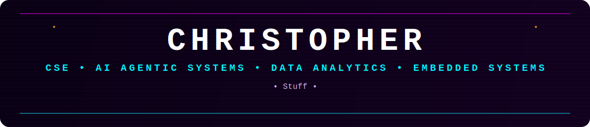

  

  

  <code>CSE STUDENT • AGENTIC AI • AUTOMATION • DATA ANALYTICS • BUILDING PRACTICAL SYSTEMS</code>

  
    <code>
      Computer Science & Engineering student focused on agentic AI systems, automation workflows, and practical software engineering. 
      I build projects in AI agents, workflow orchestration, validation systems, data analytics, testing, and real-world software pipelines. 
      Currently exploring agentic automation, LLM-powered systems, structured validation pipelines, and embedded Linux/RISC-V systems.
    </code>
  

  

## ✦ CURRENTLY_WORKING_ON

- ▶ Agentic AI workflows and multi-agent automation systems
- ▶ LLM-powered structured validation and transformation pipelines
- ▶ Data analytics and real-world dataset projects
- ▶ Python testing, validation gates, and reliable workflow design
- ▶ Embedded systems projects with Debian Linux and RISC-V
- ▶ DBMS concepts, SQL queries, triggers, cursors, and exception handling
- ▶ Practical mini-projects in Java, C++, Python, and system-level experimentation

  

## ✦ TECH_STACK

  
  
  
  
  
  
  
  
  
  
  
  
  
  
  
  
  
  
  
  
  
  
  
  
  
  
  

  

## ✦ FEATURED_PROJECTS

### ◆ RADIX Engine
A multi-agent workflow and automation system focused on structured AI pipelines, prompt interpretation, validation gates, transformation logic, and reliable output generation.

### ◆ Agent Discovery & Usage Platform
A FastAPI-based platform for registering agents, searching them, extracting tags, and tracking idempotent usage with analytics and usage summaries.

### ◆ Embedded RISC-V Debian Linux System
A practical embedded systems project involving a Debian Linux setup on a RISC-V environment, focused on low-level system interaction, Linux workflows, and system-level experimentation.

### ◆ Women’s Football Analytics
A machine learning and analytics project using data scraping, cleaning, transformation, and XGBoost-based injury prediction to uncover insights from women’s football data.

### ◆ Guardian Eye
A Python-based women’s safety project focused on building a practical safety-oriented system for awareness, monitoring, and protection-related use cases.

### ◆ Python Learning & Experimentation
A collection of hands-on notebooks and mini-projects covering NumPy, regex, JSON, testing, and practical programming fundamentals.

  

## ✦ GITHUB_STATS

  

  

  

## ✦ CONTRIBUTION_GRAPH

  

  

## ✦ CONNECT_WITH_ME

- ▶ Email: **christopherwilsonjust@gmail.com**
- ▶ LinkedIn: **[Christopher Wilson](https://www.linkedin.com/in/christopher-wilson-9b7518324/)**
- ▶ Instagram: **@christonowhere**

  
  
  

  

  <code>// BUILDING AGENTIC SYSTEMS • EXPLORING LOW-LEVEL COMPUTING • TURNING CURIOSITY INTO PRACTICAL PROJECTS //</code>

